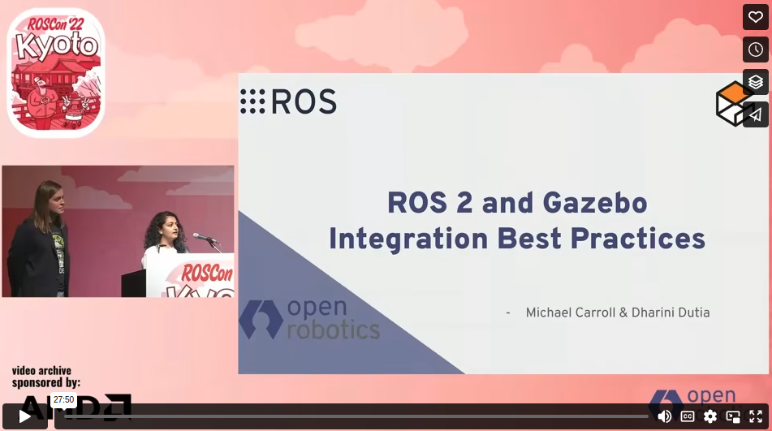

[](https://github.com/gazebosim/ros_gz/actions/workflows/ros2-ci.yml)

ROS 2 version | Gazebo version | Branch | Binaries hosted at
-- | -- | -- | --
Foxy | Citadel | [foxy](https://github.com/gazebosim/ros_gz/tree/foxy) | https://packages.ros.org
Foxy | Edifice | [foxy](https://github.com/gazebosim/ros_gz/tree/foxy) | only from source
Galactic | Edifice | [galactic](https://github.com/gazebosim/ros_gz/tree/galactic) | https://packages.ros.org
Galactic | Fortress | [galactic](https://github.com/gazebosim/ros_gz/tree/galactic) | only from source
Humble | Fortress | [humble](https://github.com/gazebosim/ros_gz/tree/humble) | https://packages.ros.org
Humble | Garden | [humble](https://github.com/gazebosim/ros_gz/tree/humble) | [gazebo packages](https://gazebosim.org/docs/latest/ros_installation#gazebo-garden-with-ros-2-humble-iron-or-rolling-use-with-caution-)[^1]
Humble | Harmonic | [humble](https://github.com/gazebosim/ros_gz/tree/humble) | [gazebo packages](https://gazebosim.org/docs/harmonic/ros_installation#-gazebo-harmonic-with-ros-2-humble-iron-or-rolling-use-with-caution-)[^1]
Iron | Fortress | [humble](https://github.com/gazebosim/ros_gz/tree/iron) | https://packages.ros.org
Iron | Garden | [humble](https://github.com/gazebosim/ros_gz/tree/iron) | only from source
Iron | Harmonic | [humble](https://github.com/gazebosim/ros_gz/tree/iron) | only from source
Jazzy | Garden | [ros2](https://github.com/gazebosim/ros_gz/tree/ros2) | only from source
Jazzy | Harmonic | [jazzy](https://github.com/gazebosim/ros_gz/tree/jazzy) | https://packages.ros.org
Rolling | Fortress | [humble](https://github.com/gazebosim/ros_gz/tree/humble) | https://packages.ros.org
Rolling | Garden | [ros2](https://github.com/gazebosim/ros_gz/tree/ros2) | only from source
Rolling | Harmonic | [ros2](https://github.com/gazebosim/ros_gz/tree/ros2) | only from source

[^1]: Binaries for these pairings are provided from a the packages.osrfoundation.org repository. Refer to https://gazebosim.org/docs/latest/ros_installation for installation instructions.

For information on ROS(1) and Gazebo compatibility, refer to the [noetic branch README](https://github.com/gazebosim/ros_gz/tree/noetic)

> Please [ticket an issue](https://github.com/gazebosim/ros_gz/issues/) if you'd like support to be added for some combination.

[Details about the renaming process](README_RENAME.md) from `ign` to `gz` .

**Note**: The `ros_ign` prefixed packages are shim packages that redirect to their `ros_gz` counterpart.
Under most circumstances you want to be using the `ros_gz` counterpart.

# Integration between ROS and Gazebo

## Packages

This repository holds packages that provide integration between
[ROS](http://www.ros.org/) and [Gazebo](https://gazebosim.org):

* [ros_gz](https://github.com/gazebosim/ros_gz/tree/ros2/ros_gz):
  Metapackage which provides all the other packages.
* [ros_gz_image](https://github.com/gazebosim/ros_gz/tree/ros2/ros_gz_image):
  Unidirectional transport bridge for images from
  [Gazebo Transport](https://gazebosim.org/libs/transport)
  to ROS using
  [image_transport](http://wiki.ros.org/image_transport).
* [ros_gz_bridge](https://github.com/gazebosim/ros_gz/tree/ros2/ros_gz_bridge):
  Bidirectional transport bridge between
  [Gazebo Transport](https://gazebosim.org/libs/transport)
  and ROS.
* [ros_gz_sim](https://github.com/gazebosim/ros_gz/tree/ros2/ros_gz_sim):
  Convenient launch files and executables for using
  [Gazebo Sim](https://gazebosim.org/libs/gazebo)
  with ROS.
* [ros_gz_sim_demos](https://github.com/gazebosim/ros_gz/tree/ros2/ros_gz_sim_demos):
  Demos using the ROS-Gazebo integration.
* [ros_gz_point_cloud](https://github.com/gazebosim/ros_gz/tree/ros2/ros_gz_point_cloud):
  Plugins for publishing point clouds to ROS from
  [Gazebo Sim](https://gazebosim.org/libs/gazebo) simulations.

## Install

This branch supports ROS Jazzy. See above for other ROS versions.

### Binaries

Rolling binaries are available for Fortress.
They are hosted at https://packages.ros.org.

1. Add https://packages.ros.org

        sudo sh -c 'echo "deb [arch=$(dpkg --print-architecture)] http://packages.ros.org/ros2/ubuntu $(lsb_release -cs) main" > /etc/apt/sources.list.d/ros2-latest.list'
        curl -s https://raw.githubusercontent.com/ros/rosdistro/master/ros.asc | sudo apt-key add -
        sudo apt-get update

1. Install `ros_gz`

        sudo apt install ros-jazzy-ros-gz

### From source

#### ROS

Be sure you've installed
[ROS Jazzy](https://docs.ros.org/en/jazzy/Installation.html)
(at least ROS-Base). More ROS dependencies will be installed below.

#### Gazebo

Install either [Garden or Harmonic](https://gazebosim.org/docs).

Set the `GZ_VERSION` environment variable to the Gazebo version you'd
like to compile against. For example:

    export GZ_VERSION=harmonic # IMPORTANT: Replace with correct version

> You only need to set this variable when compiling, not when running.

#### Compile ros_gz

The following steps are for Linux and OSX.

1. Create a colcon workspace:

    ```
    # Setup the workspace
    mkdir -p ~/ws/src
    cd ~/ws/src

    # Download needed software
    git clone https://github.com/gazebosim/ros_gz.git -b jazzy
    ```

1. Install dependencies (this may also install Gazebo):

    ```
    cd ~/ws
    rosdep install -r --from-paths src -i -y --rosdistro jazzy
    ```

    > If `rosdep` fails to install Gazebo libraries and you have not installed them before, please follow [Gazebo installation instructions](https://gazebosim.org/docs/latest/install).

1. Build the workspace:

    ```
    # Source ROS distro's setup.bash
    source /opt/ros/<distro>/setup.bash

    # Build and install into workspace
    cd ~/ws
    colcon build
    ```
  > [!TIP]
  > The `ros_gz` library makes heavy use of templates which causes compilers to consume a lot of memory. If your build fails with `c++: fatal error: Killed signal terminated program cc1plus`
  > try building with `colcon build --parallel-workers=1 --executor sequential`. You might also have to set `export MAKEFLAGS="-j 1"` before running `colcon build` to limit
  > the number of processors used to build a single package.

## ROSCon 2022

[](https://vimeo.com/showcase/9954564/video/767127300)

## Project Template
[A template project integrating ROS and Gazebo simulator](https://github.com/gazebosim/ros_gz_project_template)
