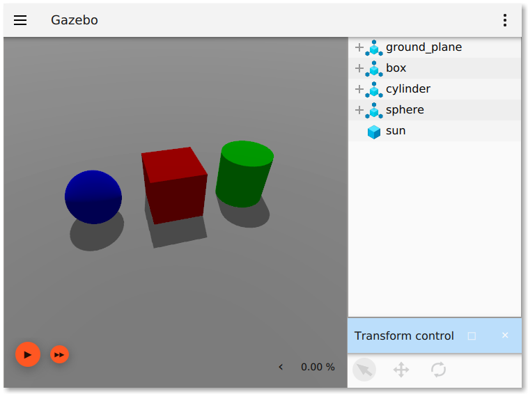
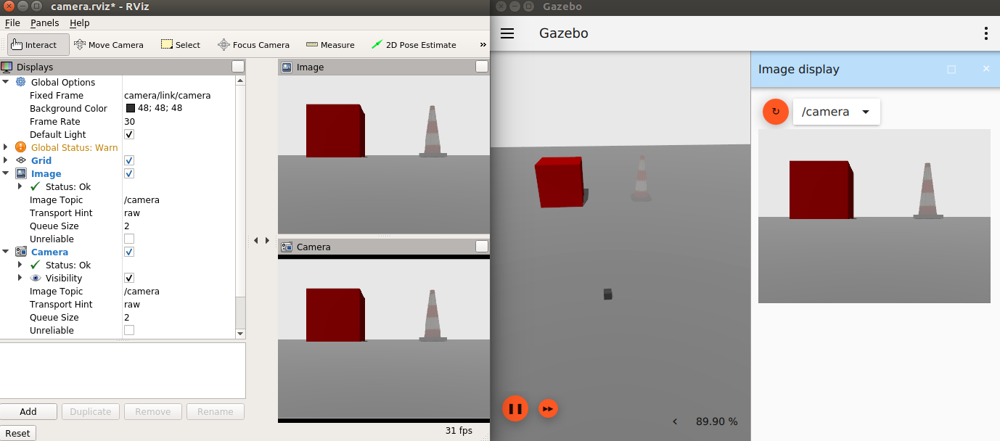
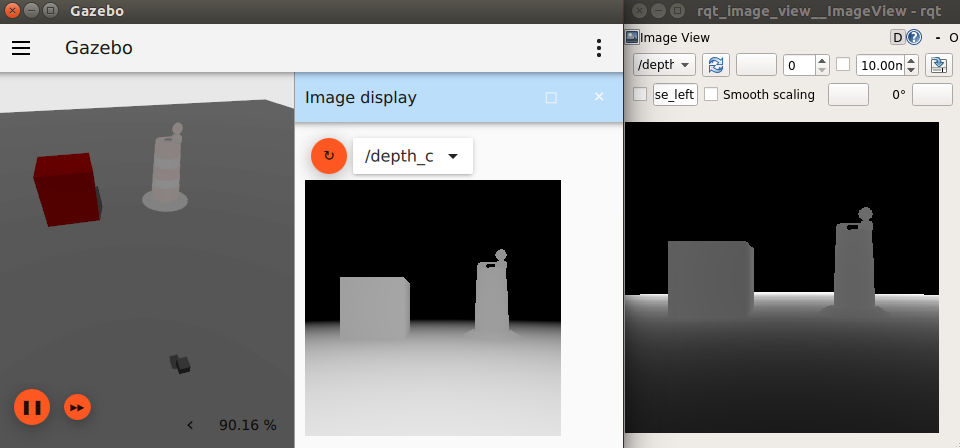
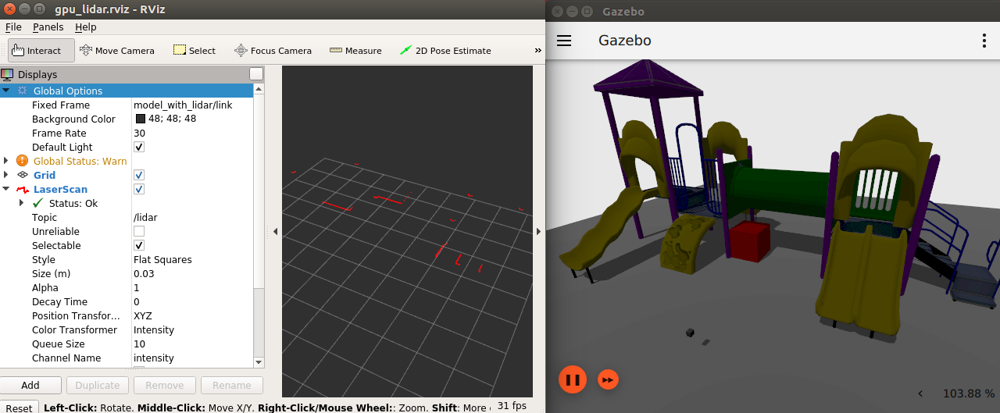
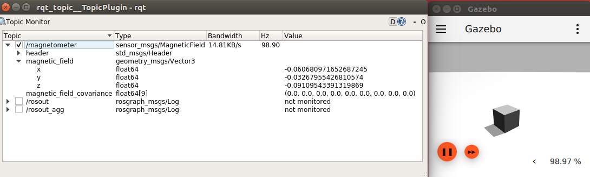
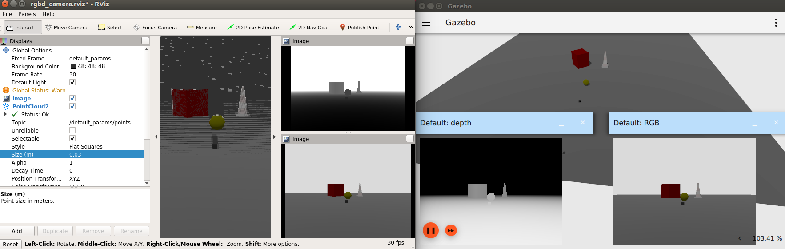

# ROS 1 + Ignition Gazebo demos

This package contains demos showing how to use Ignition Gazebo with ROS 1.

## Run Ignition Gazebo

There's a convenient launch file, try for example:

    roslaunch ros1_ign_gazebo_demos ign_gazebo.launch args:="shapes.sdf"

And you can directly call the executable, for example:

    rosrun ros1_ign_gazebo_demos ign_gazebo shapes.sdf

## Camera

Publishes RGB camera image and info.

    roslaunch ros1_ign_gazebo_demos camera.launch

## Depth camera

Publishes depth camera image.

    roslaunch ros1_ign_gazebo_demos depth_camera.launch

## GPU lidar

Publishes 2D laser scans.

    roslaunch ros1_ign_gazebo_demos gpu_lidar.launch

## IMU

Publishes IMU readings.

    roslaunch ros1_ign_gazebo_demos imu.launch

## Magnetometer

Publishes magnetic field readings.

    roslaunch ros1_ign_gazebo_demos magnetometer.launch

## RGBD camera

Publishes RGB and depth images, as well as a color point cloud.

    roslaunch ros1_ign_gazebo_demos rgbd_camera.launch

