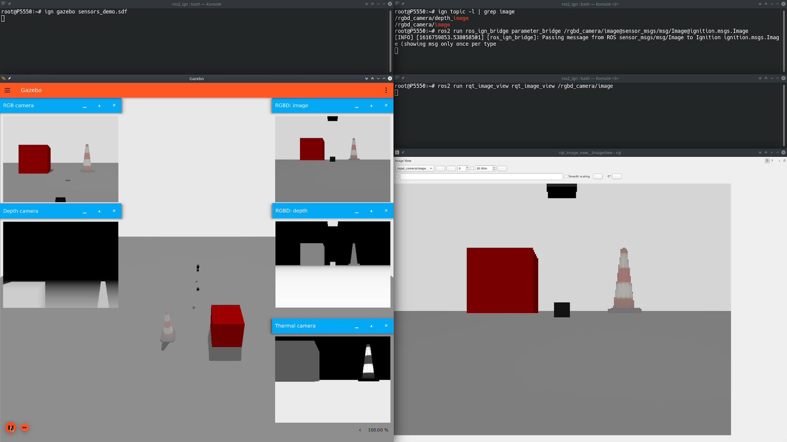

# Bridge communication between ROS and Gazebo

This package provides a network bridge which enables the exchange of messages
between ROS and Gazebo Transport.

The following message types can be bridged for topics:

| ROS type                           | Gazebo Transport Type              |
|------------------------------------|:----------------------------------:|
| builtin_interfaces/Time            | gz.msgs.Time                       |
| geometry_msgs/Point                | gz.msgs.Vector3d                   |
| geometry_msgs/Pose                 | gz.msgs.Pose                       |
| geometry_msgs/msg/PoseArray        | gz.msgs.Pose_V                     |
| geometry_msgs/PoseStamped          | gz.msgs.Pose                       |
| geometry_msgs/PoseWithCovariance   | gz.msgs.PoseWithCovariance         |
| geometry_msgs/Quaternion           | gz.msgs.Quaternion                 |
| geometry_msgs/Transform            | gz.msgs.Pose                       |
| geometry_msgs/TransformStamped     | gz.msgs.Pose                       |
| geometry_msgs/Twist                | gz.msgs.Twist                      |
| geometry_msgs/TwistWithCovariance  | gz.msgs.TwistWithCovariance        |
| geometry_msgs/Vector3              | gz.msgs.Vector3d                   |
| geometry_msgs/Wrench               | gz.msgs.Wrench                     |
| gps_msgs/GPSFix                    | gz.msgs.NavSat                     |
| nav_msgs/Odometry                  | gz.msgs.Odometry                   |
| nav_msgs/Odometry                  | gz.msgs.OdometryWithCovariance     |
| rcl_interfaces/ParameterValue      | gz.msgs.Any                        |
| ros_gz_interfaces/Contact          | gz.msgs.Contact                    |
| ros_gz_interfaces/Contacts         | gz.msgs.Contacts                   |
| ros_gz_interfaces/Dataframe        | gz.msgs.Dataframe                  |
| ros_gz_interfaces/Entity           | gz.msgs.Entity                     |
| ros_gz_interfaces/msg/Float32Array | gz.msgs.Float_V                    |
| ros_gz_interfaces/GuiCamera        | gz.msgs.GUICamera                  |
| ros_gz_interfaces/JointWrench      | gz.msgs.JointWrench                |
| ros_gz_interfaces/Light            | gz.msgs.Light                      |
| ros_gz_interfaces/ParamVec         | gz.msgs.Param                      |
| ros_gz_interfaces/ParamVec         | gz.msgs.Param_V                    |
| ros_gz_interfaces/StringVec        | gz.msgs.StringMsg_V                |
| ros_gz_interfaces/TrackVisual      | gz.msgs.TrackVisual                |
| ros_gz_interfaces/VideoRecord      | gz.msgs.VideoRecord                |
| rosgraph_msgs/Clock                | gz.msgs.Clock                      |
| sensor_msgs/BatteryState           | gz.msgs.BatteryState               |
| sensor_msgs/CameraInfo             | gz.msgs.CameraInfo                 |
| sensor_msgs/FluidPressure          | gz.msgs.FluidPressure              |
| sensor_msgs/Image                  | gz.msgs.Image                      |
| sensor_msgs/Imu                    | gz.msgs.IMU                        |
| sensor_msgs/JointState             | gz.msgs.Model                      |
| sensor_msgs/Joy                    | gz.msgs.Joy                        |
| sensor_msgs/LaserScan              | gz.msgs.LaserScan                  |
| sensor_msgs/MagneticField          | gz.msgs.Magnetometer               |
| sensor_msgs/NavSatFix              | gz.msgs.NavSat                     |
| sensor_msgs/PointCloud2            | gz.msgs.PointCloudPacked           |
| std_msgs/Bool                      | gz.msgs.Boolean                    |
| std_msgs/ColorRGBA                 | gz.msgs.Color                      |
| std_msgs/Empty                     | gz.msgs.Empty                      |
| std_msgs/Float32                   | gz.msgs.Float                      |
| std_msgs/Float64                   | gz.msgs.Double                     |
| std_msgs/Header                    | gz.msgs.Header                     |
| std_msgs/Int32                     | gz.msgs.Int32                      |
| std_msgs/String                    | gz.msgs.StringMsg                  |
| std_msgs/UInt32                    | gz.msgs.UInt32                     |
| tf2_msgs/TFMessage                 | gz.msgs.Pose_V                     |
| trajectory_msgs/JointTrajectory    | gz.msgs.JointTrajectory            |

And the following for services:

| ROS type                             | Gazebo request             | Gazebo response       |
|--------------------------------------|:--------------------------:| --------------------- |
| ros_gz_interfaces/srv/ControlWorld   | gz.msgs.WorldControl       | gz.msgs.Boolean       |

Run `ros2 run ros_gz_bridge parameter_bridge -h` for instructions.

## Example 1a: Gazebo Transport talker and ROS 2 listener

Start the parameter bridge which will watch the specified topics.

```
# Shell A:
. ~/bridge_ws/install/setup.bash
ros2 run ros_gz_bridge parameter_bridge /chatter@std_msgs/msg/String@ignition.msgs.StringMsg
```

Now we start the ROS listener.

```
# Shell B:
. /opt/ros/galactic/setup.bash
ros2 topic echo /chatter
```

Now we start the Gazebo Transport talker.

```
# Shell C:
ign topic -t /chatter -m ignition.msgs.StringMsg -p 'data:"Hello"'
```

## Example 1b: ROS 2 talker and Gazebo Transport listener

Start the parameter bridge which will watch the specified topics.

```
# Shell A:
. ~/bridge_ws/install/setup.bash
ros2 run ros_gz_bridge parameter_bridge /chatter@std_msgs/msg/String@ignition.msgs.StringMsg
```

Now we start the Gazebo Transport listener.

```
# Shell B:
ign topic -e -t /chatter
```

Now we start the ROS talker.

```
# Shell C:
. /opt/ros/galactic/setup.bash
ros2 topic pub /chatter std_msgs/msg/String "data: 'Hi'" --once
```

## Example 2: Run the bridge and exchange images

In this example, we're going to generate Gazebo Transport images using
Gazebo Sim, that will be converted into ROS images, and visualized with
`rqt_image_viewer`.

First we start Gazebo Sim (don't forget to hit play, or Gazebo Sim won't generate any images).

```
# Shell A:
ign gazebo sensors_demo.sdf
```

Let's see the topic where camera images are published.

```
# Shell B:
ign topic -l | grep image
/rgbd_camera/depth_image
/rgbd_camera/image
```

Then we start the parameter bridge with the previous topic.

```
# Shell B:
. ~/bridge_ws/install/setup.bash
ros2 run ros_gz_bridge parameter_bridge /rgbd_camera/image@sensor_msgs/msg/Image@ignition.msgs.Image
```

Now we start the ROS GUI:

```
# Shell C:
. /opt/ros/galactic/setup.bash
ros2 run rqt_image_view rqt_image_view /rgbd_camera/image
```

You should see the current images in `rqt_image_view` which are coming from
Gazebo (published as Gazebo Msgs over Gazebo Transport).

The screenshot shows all the shell windows and their expected content
(it was taken using ROS 2 Galactic and Gazebo Fortress):



## Example 3: Static bridge

In this example, we're going to run an executable that starts a bidirectional
bridge for a specific topic and message type. We'll use the `static_bridge`
executable that is installed with the bridge.

The example's code can be found under `ros_gz_bridge/src/static_bridge.cpp`.
In the code, it's possible to see how the bridge is hardcoded to bridge string
messages published on the `/chatter` topic.

Let's give it a try, starting with Gazebo -> ROS 2.

On terminal A, start the bridge:

`ros2 run ros_gz_bridge static_bridge`

On terminal B, we start a ROS 2 listener:

`ros2 topic echo /chatter std_msgs/msg/String`

And terminal C, publish an Gazebo message:

`ign topic -t /chatter -m ignition.msgs.StringMsg -p 'data:"Hello"'`

At this point, you should see the ROS 2 listener echoing the message.

Now let's try the other way around, ROS 2 -> Gazebo.

On terminal D, start an Igntion listener:

`ign topic -e -t /chatter`

And on terminal E, publish a ROS 2 message:

`ros2 topic pub /chatter std_msgs/msg/String 'data: "Hello"' -1`

You should see the Gazebo listener echoing the message.

## Example 4: Service bridge

It's possible to make ROS service requests into Gazebo. Let's try unpausing the simulation.

On terminal A, start the service bridge:

`ros2 run ros_gz_bridge parameter_bridge /world/shapes/control@ros_gz_interfaces/srv/ControlWorld`

On terminal B, start Gazebo, it will be paused by default:

`ign gazebo shapes.sdf`

On terminal C, make a ROS request to unpause simulation:

```
ros2 service call /world/<world_name>/control ros_gz_interfaces/srv/ControlWorld "{world_control: {pause: false}}"
```

## Example 5: Configuring the Bridge via YAML

When configuring many topics, it is easier to use a file-based configuration in a markup
language. In this case, the `ros_gz` bridge supports using a YAML file to configure the
various parameters.

The configuration file must be a YAML array of maps.
An example configuration for 5 bridges is below, showing the various ways that a
bridge may be specified:

```yaml
 # Set just topic name, applies to both
- topic_name: "chatter"
  ros_type_name: "std_msgs/msg/String"
  gz_type_name: "ignition.msgs.StringMsg"

# Set just ROS topic name, applies to both
- ros_topic_name: "chatter_ros"
  ros_type_name: "std_msgs/msg/String"
  gz_type_name: "ignition.msgs.StringMsg"

# Set just GZ topic name, applies to both
- gz_topic_name: "chatter_ign"
  ros_type_name: "std_msgs/msg/String"
  gz_type_name: "ignition.msgs.StringMsg"

# Set each topic name explicitly
- ros_topic_name: "chatter_both_ros"
  gz_topic_name: "chatter_both_ign"
  ros_type_name: "std_msgs/msg/String"
  gz_type_name: "ignition.msgs.StringMsg"

# Full set of configurations
- ros_topic_name: "ros_chatter"
  gz_topic_name: "ign_chatter"
  ros_type_name: "std_msgs/msg/String"
  gz_type_name: "ignition.msgs.StringMsg"
  subscriber_queue: 5       # Default 10
  publisher_queue: 6        # Default 10
  lazy: true                # Default "false"
  direction: BIDIRECTIONAL  # Default "BIDIRECTIONAL" - Bridge both directions
                            # "GZ_TO_ROS" - Bridge Ignition topic to ROS
                            # "ROS_TO_GZ" - Bridge ROS topic to Ignition
```

To run the bridge node with the above configuration:
```bash
ros2 run ros_gz_bridge parameter_bridge --ros-args -p config_file:=$WORKSPACE/ros_gz/ros_gz_bridge/test/config/full.yaml
```

## API

ROS 2 Parameters:

 * `subscription_heartbeat` - Period at which the node checks for new subscribers for lazy bridges.
 * `config_file` - YAML file to be loaded as the bridge configuration
