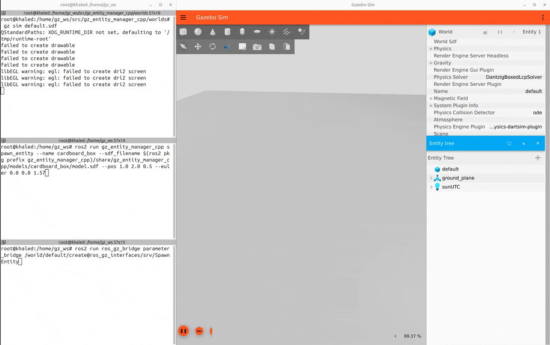
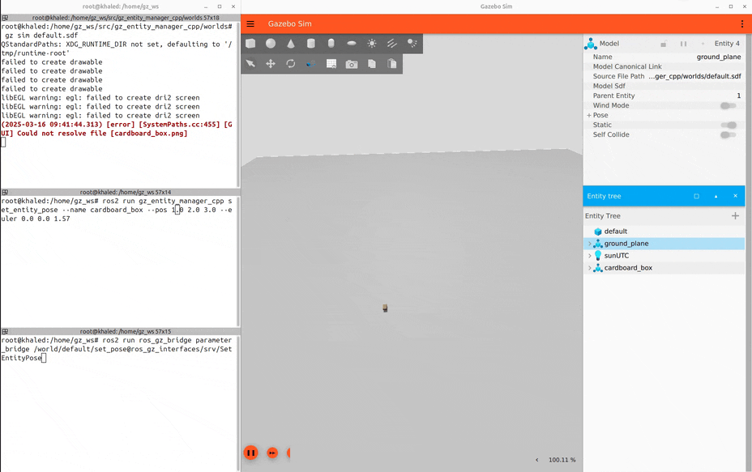

# ROS-Gazebo Interface Demos

A ROS 2 package for managing entities in Gazebo simulations through the ROS-Gazebo bridge.

## Overview

The `ros_gz_interface_demos` package provides a set of utilities for managing entities (models, lights, links, etc.) in Gazebo simulations through ROS 2.
This package enables seamless communication between ROS 2 and Gazebo, allowing you to:

- **Spawn entities**: Add new models and objects to a running Gazebo simulation
- **Set entity poses**: Dynamically adjust the position and orientation of existing entities
- **Delete entities**: Remove entities from the simulation environment

These utilities are particularly useful for dynamic simulation scenarios, testing robotics algorithms, and creating complex simulation environments programmatically.

## Features

- Support for various entity types (models, lights, links, visuals, etc.)
- Position specification using both quaternions and Euler angles
- Comprehensive error reporting

## Prerequisites

- ROS 2
- Gazebo 
- ROS-Gazebo bridge package (`ros_gz_bridge`)

## Installation

### From Source

1. Create a ROS 2 workspace (if you don't have one):

```bash
mkdir -p ~/ros_gz_ws/src
cd ~/ros_gz_ws/src
```

2. Clone the repository:

```bash
git clone https://github.com/gazebosim/ros_gz
```

3. Install dependencies:

```bash
cd ~/ros_gz_ws
rosdep install --from-paths src --ignore-src -r -y
```

4. Build the package:

```bash
colcon build --symlink-install
```

5. Source the workspace:

```bash
source ~/ros_gz_ws/install/setup.bash
```

## Usage

### Launching Gazebo

Before using the utilities, you need to start Gazebo with your desired world:

```bash
gz sim -v 4 ~/ros_gz_ws/src/ros_gz_interface_demos/worlds/default.sdf
```

### 1. Spawning Entities

Spawn new entities into the simulation:

1. Run the ROS-Gazebo bridge for the spawn service:

```bash
ros2 run ros_gz_bridge parameter_bridge /world/default/create@ros_gz_interfaces/srv/SpawnEntity
```

2. Spawn your entity:

```bash
ros2 run ros_gz_interface_demos spawn_entity --name <model_name> --sdf_filename <path_to_sdf_file> [--pos x y z] [--quat x y z w | --euler roll pitch yaw]
```

**Example:**

```bash
ros2 run ros_gz_interface_demos spawn_entity --name cardboard_box --sdf_filename $(ros2 pkg prefix ros_gz_interface_demos)/share/ros_gz_interface_demos/models/cardboard_box/model.sdf --pos 1.0 2.0 0.5 --euler 0.0 0.0 1.57
```

or

```bash
ros2 run ros_gz_interface_demos spawn_entity --name cardboard_box --sdf_filename /full/path/to/ros_gz_ws/src/ros_gz_interface_demos/models/cardboard_box/model.sdf --pos 1.0 2.0 0.5 --euler 0.0 0.0 1.57
```



### 2. Setting Entity Poses

Dynamically adjust the position and orientation of existing entities:

1. Run the ROS-Gazebo bridge for the set pose service:

```bash
ros2 run ros_gz_bridge parameter_bridge /world/default/set_pose@ros_gz_interfaces/srv/SetEntityPose
```

2. Set the entity's pose:

```bash
ros2 run ros_gz_interface_demos set_entity_pose [--name NAME | --id ID] [--type TYPE] [--pos X Y Z] [--quat X Y Z W | --euler ROLL PITCH YAW]
```

**Examples:**

Using entity name with Euler angles for rotation:

```bash
ros2 run ros_gz_interface_demos set_entity_pose --name cardboard_box --pos 3.0 4.0 1.0 --euler 0.0 0.0 1.57
```

Using entity ID with quaternion for rotation:

```bash
ros2 run ros_gz_interface_demos set_entity_pose --id 8 --pos 3.0 4.0 1.0 --quat 0.0 0.0 0.7071 0.7071
```



### 3. Deleting Entities

Remove entities from the simulation:

1. Run the ROS-Gazebo bridge for the delete service:

```bash
ros2 run ros_gz_bridge parameter_bridge /world/default/remove@ros_gz_interfaces/srv/DeleteEntity
```

2. Delete the entity:

```bash
ros2 run ros_gz_interface_demos delete_entity [--name NAME | --id ID] [--type TYPE]
```

**Examples:**

Using entity name:

```bash
ros2 run ros_gz_interface_demos delete_entity --name cardboard_box
```

Using entity ID:

```bash
ros2 run ros_gz_interface_demos delete_entity --id 8
```

Using a specific entity type:

```bash
ros2 run ros_gz_interface_demos delete_entity --name cardboard_box --type 2
```


## Entity Type Reference

When using the `set_entity_pose` and `delete_entity` commands, you can specify the entity type using the `--type` flag. The following type values are available:

| Value | Entity Type |
|-------|-------------|
| 0     | NONE        |
| 1     | LIGHT       |
| 2     | LINK        |
| 3     | VISUAL      |
| 4     | COLLISION   |
| 5     | SENSOR      |
| 6     | MODEL (default) |

## Troubleshooting

1. **Service not available**: If you see "Service not available, waiting..." messages, ensure that:
   - Gazebo is running with the correct world
   - The ROS-Gazebo bridge is running for the correct service
   - The world name in your service path matches your Gazebo world name (default: "default")

2. **Failed to spawn/delete/set pose**: Check that:
   - The entity name or ID is correct
   - The entity type is correct (if specified)
   - The SDF file path is valid (for spawn_entity)

3. **File not found errors**: Ensure you're using absolute paths or properly referenced relative paths for model SDF files.
