# ROS + Gazebo Sim demos

This package contains demos showing how to use Gazebo Sim with ROS.

## Run Gazebo Sim

There's a convenient launch file, try for example:

    ros2 launch ros_gz_sim gz_sim.launch.py gz_args:="shapes.sdf"

## Air pressure

Publishes fluid pressure readings.

    ros2 launch ros_gz_sim_demos air_pressure.launch.py

This demo also shows the use of custom QoS parameters. The sensor data is
published as as "best-effort", so trying to subscribe to "reliable" data won't
work. See the difference between:

    ros2 topic echo /air_pressure --qos-reliability best_effort

And

    ros2 topic echo /air_pressure --qos-reliability reliable

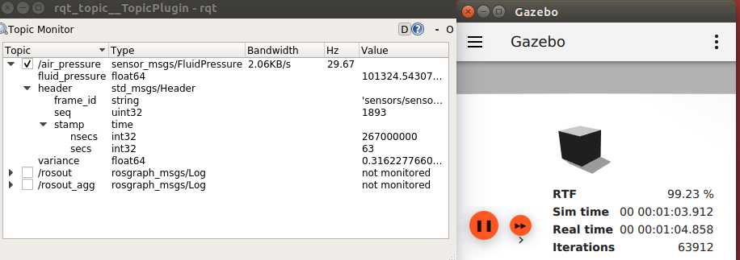

## Camera

Publishes RGB camera image and info.

Images can be exposed to ROS through `ros_gz_bridge` or `ros_gz_image`.

Using the image bridge (unidirectional, uses [image_transport](http://wiki.ros.org/image_transport)):

    ros2 launch ros_gz_sim_demos image_bridge.launch.py

Using the regular bridge:

    ros2 launch ros_gz_sim_demos camera.launch.py

To use a camera that only publishes information when triggered:

    ros2 launch ros_gz_sim_demos triggered_camera.launch.py

Trigger the camera:

    ros2 topic pub /camera/trigger std_msgs/msg/Bool "{data: true}" --once

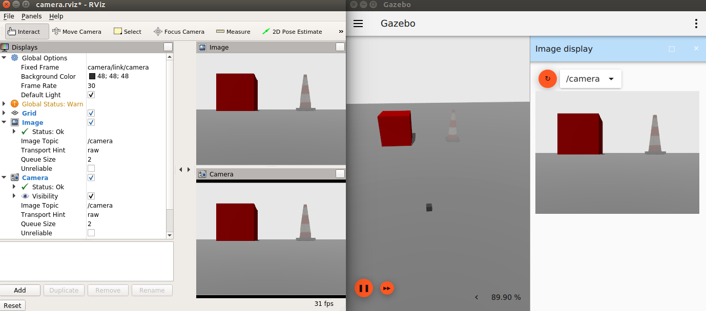

## Diff drive

Send commands to a differential drive vehicle and listen to its odometry.

    ros2 launch ros_gz_sim_demos diff_drive.launch.py

Then unpause and send a command

    ros2 topic pub /model/vehicle_blue/cmd_vel geometry_msgs/msg/Twist "{linear: {x: 5.0}, angular: {z: 0.5}}"

This demo also shows the use of custom QoS parameters. The commands are
subscribed to as "reliable", so trying to publish "best-effort" commands
won't work. See the difference between:

    ros2 topic pub /model/vehicle_blue/cmd_vel geometry_msgs/msg/Twist "{linear: {x: 5.0}, angular: {z: 0.0}}" --qos-reliability reliable

And

    ros2 topic pub /model/vehicle_blue/cmd_vel geometry_msgs/msg/Twist "{linear: {x: 5.0}, angular: {z: 0.0}}" --qos-reliability best_effort

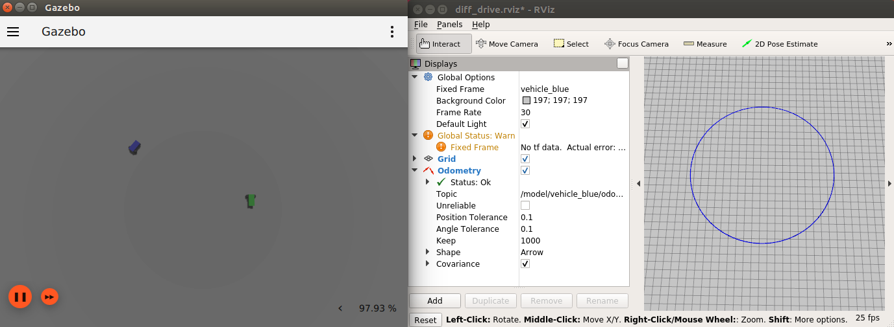

## Depth camera

Depth camera data can be obtained as:

* `sensor_msgs/msg/Image`, through `ros_gz_bridge` or `ros_gz_image`
* `sensor_msgs/msg/PointCloud2`, through `ros_gz_point_cloud`

Using the image bridge (unidirectional, uses [image_transport](http://wiki.ros.org/image_transport)):

    ros2 launch ros_gz_sim_demos image_bridge.launch.py image_topic:=/depth_camera

*TODO*: Blocked by `ros_gz_point_cloud` [issue](https://github.com/gazebosim/ros_gz/issues/40).

Using Gazebo Sim plugin:

    ros2 launch ros_gz_sim_demos depth_camera.launch.py

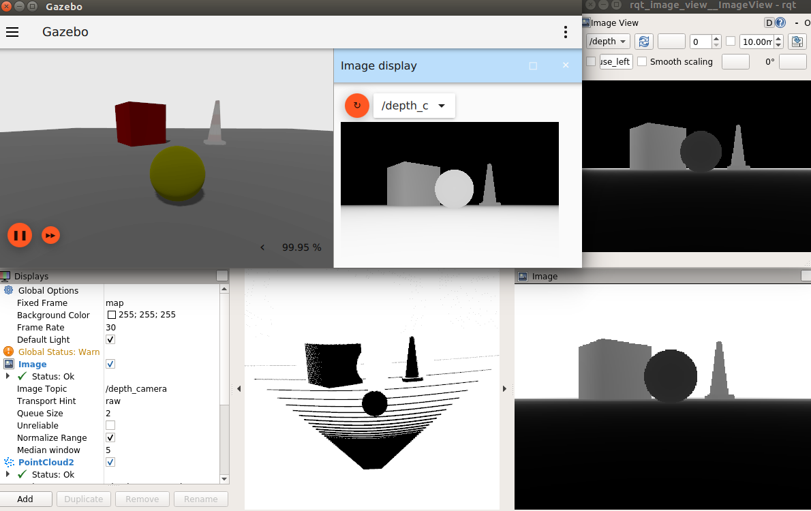

## GPU lidar

GPU lidar data can be obtained as:

* `sensor_msgs/msg/LaserScan`, through the `ros_gz_bridge`
* `sensor_msgs/msg/PointCloud2`, through the `ros_gz_bridge` or `ros_gz_point_cloud`

Using the bridge:

    ros2 launch ros_gz_sim_demos gpu_lidar_bridge.launch.py

*TODO*: Blocked by `ros_gz_point_cloud` [issue](https://github.com/gazebosim/ros_gz/issues/40).

Using Gazebo Sim plugin:

    ros2 launch ros_gz_sim_demos gpu_lidar.launch.py

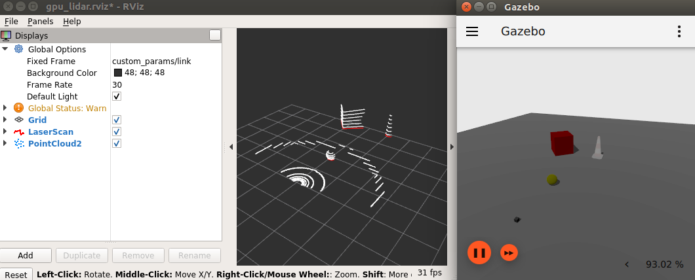

## IMU

Publishes IMU readings.

    ros2 launch ros_gz_sim_demos imu.launch.py

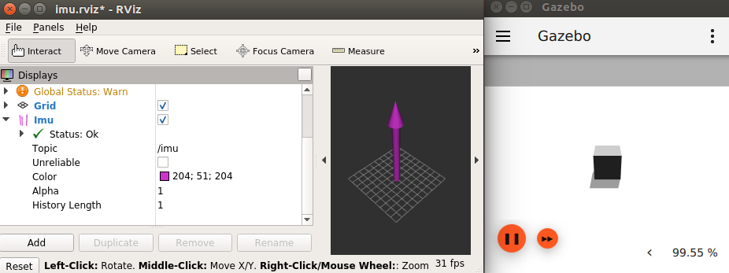

*TODO*: IMU display missing for RViz2

## Magnetometer

Publishes magnetic field readings.

    ros2 launch ros_gz_sim_demos magnetometer.launch.py

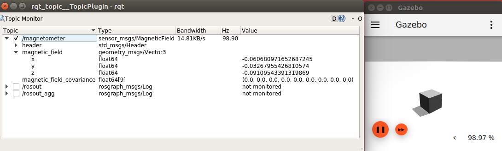

## GNSS

Publishes satellite navigation readings, only available in Fortress on.

    ros2 launch ros_gz_sim_demos navsat.launch.py

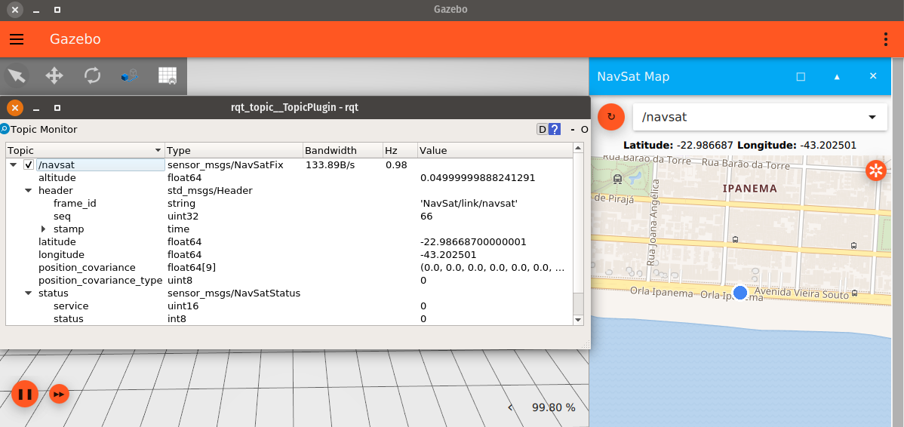

## RGBD camera

RGBD camera data can be obtained as:

* `sensor_msgs/msg/Image`, through `ros_gz_bridge` or `ros_gz_image`
* `sensor_msgs/msg/PointCloud2`, through `ros_gz_bridge` or `ros_gz_point_cloud`

Using the image bridge (unidirectional, uses [image_transport](http://wiki.ros.org/image_transport)):

    # RGB image
    ros2 launch ros_gz_sim_demos image_bridge.launch.py image_topic:=/rgbd_camera/image
    # Depth image
    ros2 launch ros_gz_sim_demos image_bridge.launch.py image_topic:=/rgbd_camera/depth_image

Using the regular bridge:

    ros2 launch ros_gz_sim_demos rgbd_camera_bridge.launch.py

*TODO*: Blocked by `ros_gz_point_cloud` [issue](https://github.com/gazebosim/ros_gz/issues/40).

Using Gazebo Sim plugin:

    ros2 launch ros_gz_sim_demos rgbd_camera.launch.py

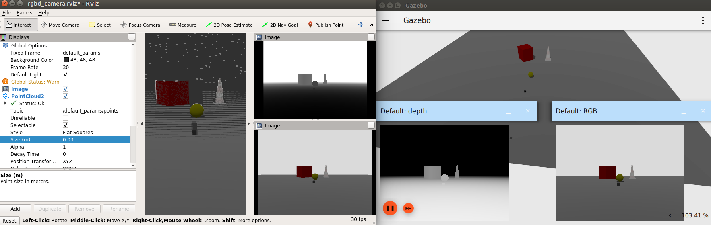

## Battery

Get the current state of a battery.

    ros2 launch ros_gz_sim_demos battery.launch.py

Then send a command so the vehicle moves and drains the battery

    ros2 topic pub /model/vehicle_blue/cmd_vel geometry_msgs/msg/Twist "{linear: {x: 5.0}, angular: {z: 0.5}}"

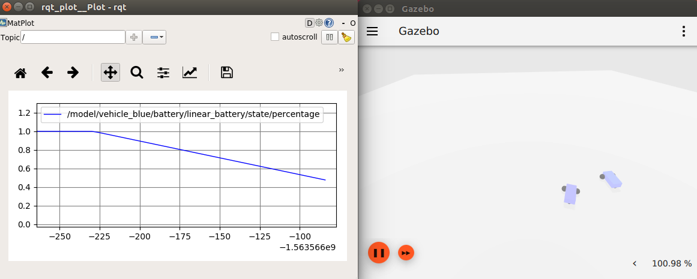

## Robot description publisher

Leverage the robot description publisher to spawn a new urdf model in gazebo and
show it in rviz2.
To try the demo launch:

    ros2 launch ros_gz_sim_demos robot_description_publisher.launch.py

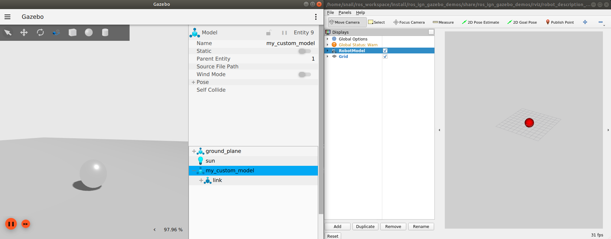

## Joint States Publisher

Publishes joint states of the robot.

To try the demo launch:

    ros2 launch ros_gz_sim_demos joint_states.launch.py

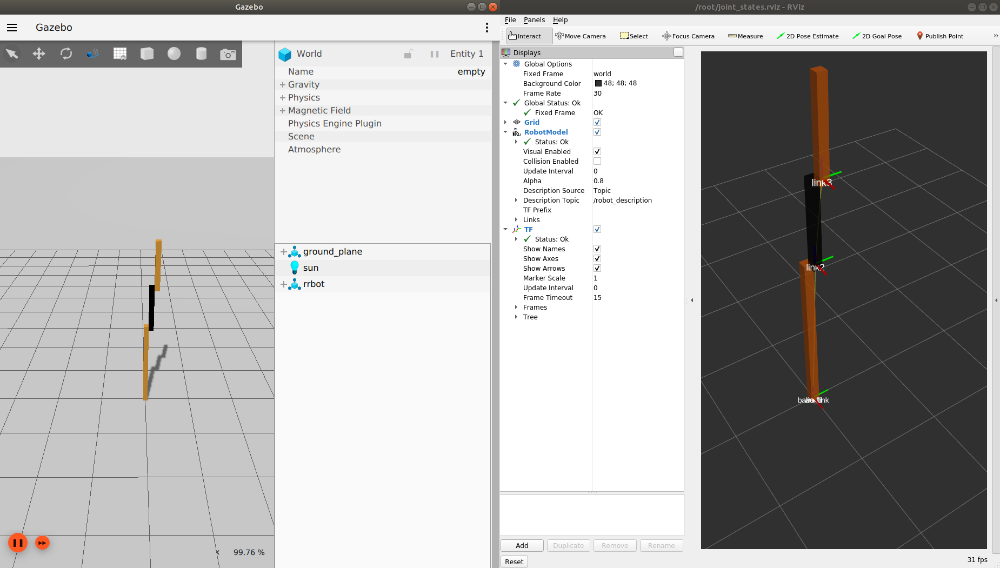

## Bridging joint state and pose publishers

The launch file demonstrates bridging Gazebo poses to TFMessage to visualize the pose
and transforms of a robot in rviz.

To try the demo launch:

    ros2 launch ros_gz_sim_demos tf_bridge.launch.py

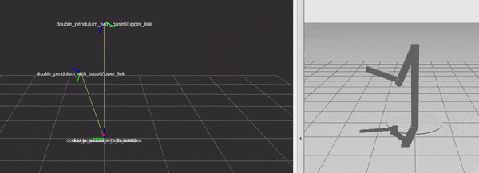
