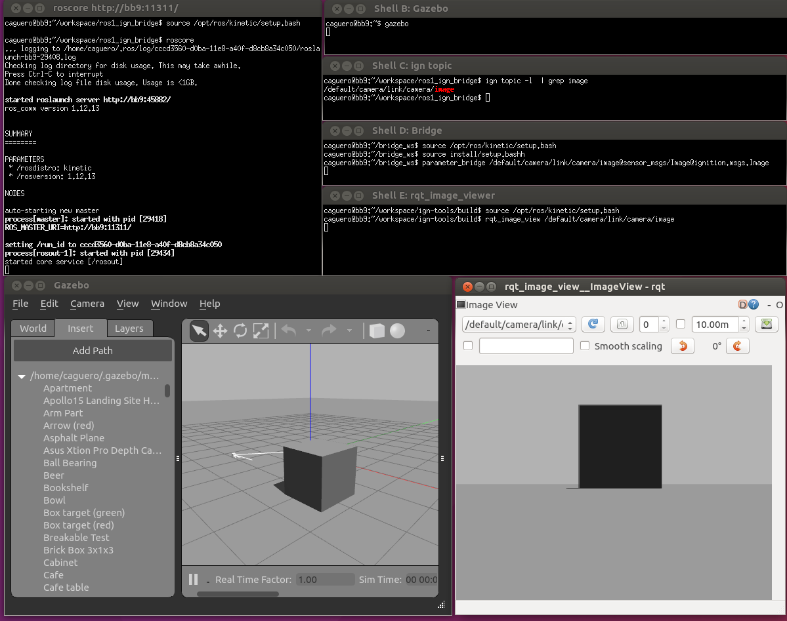

# Bridge communication between ROS and Ignition Transport

This package provides a network bridge which enables the exchange of messages
between ROS and Ignition Transport.

The bridge is currently implemented in C++. At this point there's no support for
service calls. Its support is limited to only the following message types:

| ROS type                             | Ignition Transport type              |
|--------------------------------------|:------------------------------------:|
| std_msgs/msg/Bool                    | ignition::msgs::Boolean              |
| std_msgs/msg/ColorRGBA               | ignition::msgs::Color                |
| std_msgs/msg/Empty                   | ignition::msgs::Empty                |
| std_msgs/msg/Float32                 | ignition::msgs::Float                |
| std_msgs/msg/Float64                 | ignition::msgs::Double               |
| std_msgs/msg/Header                  | ignition::msgs::Header               |
| std_msgs/msg/Int32                   | ignition::msgs::Int32                |
| std_msgs/msg/UInt32                  | ignition::msgs::UInt32               |
| std_msgs/msg/String                  | ignition::msgs::StringMsg            |
| geometry_msgs/msg/Wrench             | ignition::msgs::Wrench               |
| geometry_msgs/msg/Quaternion         | ignition::msgs::Quaternion           |
| geometry_msgs/msg/Vector3            | ignition::msgs::Vector3d             |
| geometry_msgs/msg/Point              | ignition::msgs::Vector3d             |
| geometry_msgs/msg/Pose               | ignition::msgs::Pose                 |
| geometry_msgs/msg/PoseStamped        | ignition::msgs::Pose                 |
| geometry_msgs/msg/Transform          | ignition::msgs::Pose                 |
| geometry_msgs/msg/TransformStamped   | ignition::msgs::Pose                 |
| geometry_msgs/msg/Twist              | ignition::msgs::Twist                |
| mav_msgs/msg/Actuators (TODO)        | ignition::msgs::Actuators (TODO)     |
| nav_msgs/msg/Odometry                | ignition::msgs::Odometry             |
| rcl_interfaces/msg/ParameterValue    | ignition::msgs::Any                  |
| ros_ign_interfaces/msg/Contact       | ignition::msgs::Contact              |
| ros_ign_interfaces/msg/Contacts      | ignition::msgs::Contacts             |
| ros_ign_interfaces/msg/Dataframe     | ignition::msgs::Dataframe            |
| ros_ign_interfaces/msg/Entity        | ignition::msgs::Entity               |
| ros_ign_interfaces/msg/GuiCamera     | ignition::msgs::GUICamera            |
| ros_ign_interfaces/msg/JointWrench   | ignition::msgs::JointWrench          |
| ros_ign_interfaces/msg/Light         | ignition::msgs::Light                |
| ros_ign_interfaces/msg/ParamVec      | ignition::msgs::Param                |
| ros_ign_interfaces/msg/ParamVec      | ignition::msgs::Param_V              |
| ros_ign_interfaces/msg/StringVec     | ignition::msgs::StringMsg_V          |
| ros_ign_interfaces/msg/TrackVisual   | ignition::msgs::TrackVisual          |
| ros_ign_interfaces/msg/VideoRecord   | ignition::msgs::VideoRecord          |
| rosgraph_msgs/msg/Clock              | ignition::msgs::Clock                |
| sensor_msgs/msg/BatteryState         | ignition::msgs::BatteryState         |
| sensor_msgs/msg/CameraInfo           | ignition::msgs::CameraInfo           |
| sensor_msgs/msg/FluidPressure        | ignition::msgs::FluidPressure        |
| sensor_msgs/msg/Imu                  | ignition::msgs::IMU                  |
| sensor_msgs/msg/Image                | ignition::msgs::Image                |
| sensor_msgs/msg/JointState           | ignition::msgs::Model                |
| sensor_msgs/msg/LaserScan            | ignition::msgs::LaserScan            |
| sensor_msgs/msg/MagneticField        | ignition::msgs::Magnetometer         |
| sensor_msgs/msg/NavSatFix            | ignition::msgs::NavSat               |
| sensor_msgs/msg/PointCloud2          | ignition::msgs::PointCloudPacked     |
| tf2_msgs/msg/TFMessage               | ignition::msgs::Pose_V               |
| trajectory_msgs/msg/JointTrajectory  | ignition::msgs::JointTrajectory      |

Run `ros2 run ros_ign_bridge parameter_bridge -h` for instructions.

## Example 1a: Ignition Transport talker and ROS 2 listener

Start the parameter bridge which will watch the specified topics.

```
# Shell A:
. ~/bridge_ws/install/setup.bash
ros2 run ros_ign_bridge parameter_bridge /chatter@std_msgs/msg/String@ignition.msgs.StringMsg
```

Now we start the ROS listener.

```
# Shell B:
. /opt/ros/galactic/setup.bash
ros2 topic echo /chatter
```

Now we start the Ignition Transport talker.

```
# Shell C:
ign topic pub -t /chatter -m ignition.msgs.StringMsg -p 'data:"Hello"'
```

## Example 1b: ROS 2 talker and Ignition Transport listener

Start the parameter bridge which will watch the specified topics.

```
# Shell A:
. ~/bridge_ws/install/setup.bash
ros2 run ros_ign_bridge parameter_bridge /chatter@std_msgs/msg/String@ignition.msgs.StringMsg
```

Now we start the Ignition Transport listener.

```
# Shell B:
ign topic -e -t /chatter
```

Now we start the ROS talker.

```
# Shell C:
. /opt/ros/galactic/setup.bash
ros2 topic pub /chatter std_msgs/msg/String "data: 'Hi'" --once
```

## Example 2: Run the bridge and exchange images

In this example, we're going to generate Ignition Transport images using
Ignition Gazebo, that will be converted into ROS images, and visualized with
`rqt_image_viewer`.

First we start Ignition Gazebo.

```
# Shell A:
ign gazebo sensors_demo.sdf
```

Let's see the topic where camera images are published.

```
# Shell B:
ign topic -l | grep image
/rgbd_camera/depth_image
/rgbd_camera/image
```

Then we start the parameter bridge with the previous topic.

```
# Shell B:
. ~/bridge_ws/install/setup.bash
ros2 run ros_ign_bridge parameter_bridge /rgbd_camera/image@sensor_msgs/msg/Image@ignition.msgs.Image
```

Now we start the ROS GUI:

```
# Shell C:
. /opt/ros/galactic/setup.bash
ros2 run rqt_image_view rqt_image_view /rgbd_camera/image
```

You should see the current images in `rqt_image_view` which are coming from
Gazebo (published as Ignition Msgs over Ignition Transport).

The screenshot shows all the shell windows and their expected content
(it was taken using ROS 2 Galactic and Ignition Fortress):



## Example 3: Static bridge

In this example, we're going to run an executable that starts a bidirectional
bridge for a specific topic and message type. We'll use the `static_bridge`
executable that is installed with the bridge.

The example's code can be found under `ros_ign_bridge/src/static_bridge.cpp`.
In the code, it's possible to see how the bridge is hardcoded to bridge string
messages published on the `/chatter` topic.

Let's give it a try, starting with Ignition -> ROS 2.

On terminal A, start the bridge:

`ros2 run ros_ign_bridge static_bridge`

On terminal B, we start a ROS 2 listener:

`ros2 topic echo /chatter std_msgs/msg/String`

And terminal C, publish an Ignition message:

`ign topic pub -t /chatter -m ignition.msgs.StringMsg -p 'data:"Hello"'`

At this point, you should see the ROS 2 listener echoing the message.

Now let's try the other way around, ROS 2 -> Ignition.

On terminal D, start an Igntion listener:

`ign topic -e -t /chatter`

And on terminal E, publish a ROS 2 message:

`ros2 topic pub /chatter std_msgs/msg/String 'data: "Hello"' -1`

You should see the Ignition listener echoing the message.

## Example 4: Configuring the Bridge via YAML

When configuring many topics, it is easier to use a file-based configuration in a markup
language. In this case, the `ros_ign` bridge supports using a YAML file to configure the
various parameters.

The configuration file must be a YAML array of maps.
An example configuration for 5 bridges is below, showing the various ways that a
bridge may be specified:

```yaml
 # Set just topic name, applies to both
- topic_name: "chatter"
  ros_type_name: "std_msgs/msg/String"
  ign_type_name: "ignition.msgs.StringMsg"

# Set just ROS topic name, applies to both
- ros_topic_name: "chatter_ros"
  ros_type_name: "std_msgs/msg/String"
  ign_type_name: "ignition.msgs.StringMsg"

# Set just IGN topic name, applies to both
- ign_topic_name: "chatter_ign"
  ros_type_name: "std_msgs/msg/String"
  ign_type_name: "ignition.msgs.StringMsg"

# Set each topic name explicitly
- ros_topic_name: "chatter_both_ros"
  ign_topic_name: "chatter_both_ign"
  ros_type_name: "std_msgs/msg/String"
  ign_type_name: "ignition.msgs.StringMsg"

# Full set of configurations
- ros_topic_name: "ros_chatter"
  ign_topic_name: "ign_chatter"
  ros_type_name: "std_msgs/msg/String"
  ign_type_name: "ignition.msgs.StringMsg"
  subscriber_queue: 5       # Default 10
  publisher_queue: 6        # Default 10
  lazy: true                # Default "false"
  direction: BIDIRECTIONAL  # Default "BIDIRECTIONAL" - Bridge both directions
                            # "IGN_TO_ROS" - Bridge Ignition topic to ROS
                            # "ROS_TO_IGN" - Bridge ROS topic to Ignition
```

To run the bridge node with the above configuration:
```bash
ros2 run ros_ign_bridge bridge_node --ros-args -p config_file:=$WORKSPACE/ros_ign/ros_ign_bridge/test/config/full.yaml
```

## API

ROS 2 Parameters:

 * `subscription_heartbeat` - Period at which the node checks for new subscribers for lazy bridges.
 * `config_file` - YAML file to be loaded as the bridge configuration

