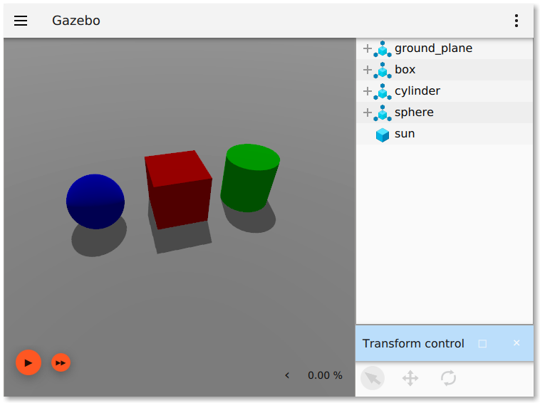

# ROS + Ignition Gazebo

This package contains things that make it convenient to integrate ROS with
Ignition, such as:

* Launch files
* ROS-enabled executables

# Usage

> More usage examples can be seen on the
[ros_ign_gazebo_demos](https://github.com/osrf/ros_ign/tree/melodic/ros_ign_gazebo_demos)
package.

## Run Ignition Gazebo

There's a convenient launch file, try for example:

    roslaunch ros_ign_gazebo ign_gazebo.launch ign_args:="shapes.sdf"

And you can directly call the executable, for example:

    roscore
    rosrun ros_ign_gazebo ign_gazebo shapes.sdf

## Spawn entities

The `create` executable can be used to spawn SDF or URDF entities from:

* A file on disk or from Ignition Fuel
* A ROS parameter

For example, start Ignition Gazebo:

`ign gazebo`

And a ROS core:

`roscore`

Then spawn a model:

`rosrun ros_ign_gazebo create -world default -file 'https://fuel.ignitionrobotics.org/1.0/openrobotics/models/Gazebo'`

See more options with:

`rosrun ros_ign_gazebo create --helpshort`
