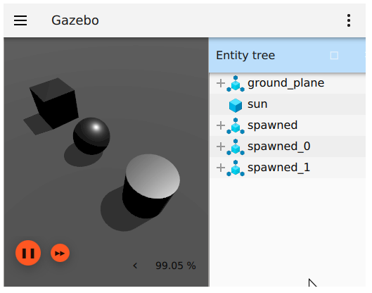

# ROS + Ignition Gazebo demos

This package contains demos showing how to use Ignition Gazebo with ROS.

## Air pressure

Publishes fluid pressure readings.

    roslaunch ros_ign_gazebo_demos air_pressure.launch

## Camera

Publishes RGB camera image and info.

Images can be exposed to ROS through `ros_ign_bridge` or `ros_ign_image`.

Using the image bridge (unidirectional, uses [image_transport](http://wiki.ros.org/image_transport)):

    roslaunch ros_ign_gazebo_demos image_bridge.launch

Using the regular bridge:

    roslaunch ros_ign_gazebo_demos camera.launch

## Diff drive

Send commands to a differential drive vehicle and listen to its odometry.

    roslaunch ros_ign_gazebo_demos diff_drive.launch

Then send a command

    rostopic pub /model/vehicle_blue/cmd_vel geometry_msgs/Twist "{linear: {x: 5.0}, angular: {z: 0.5}}"

## Depth camera

Depth camera data can be obtained as:

* `sensor_msgs/Image`, through `ros_ign_bridge` or `ros_ign_image`
* `sensor_msgs/PointCloud2`, through `ros_ign_point_cloud` (See issue #40)

Using the image bridge (unidirectional, uses [image_transport](http://wiki.ros.org/image_transport)):

    roslaunch ros_ign_gazebo_demos image_bridge.launch

Using Ignition Gazebo plugin:

    roslaunch ros_ign_gazebo_demos depth_camera.launch

## GPU lidar

GPU lidar data can be obtained as:

* `sensor_msgs/LaserScan`, through the `ros_ign_bridge`
* `sensor_msgs/PointCloud2`, through the `ros_ign_bridge` or `ros_ign_point_cloud` (See issue #40)

Using the bridge:

    roslaunch ros_ign_gazebo_demos gpu_lidar_bridge.launch

Using Ignition Gazebo plugin:

    roslaunch ros_ign_gazebo_demos gpu_lidar.launch

## IMU

Publishes IMU readings.

    roslaunch ros_ign_gazebo_demos imu.launch

## Magnetometer

Publishes magnetic field readings.

    roslaunch ros_ign_gazebo_demos magnetometer.launch

## RGBD camera

RGBD camera data can be obtained as:

* `sensor_msgs/Image`, through `ros_ign_bridge` or `ros_ign_image`
* `sensor_msgs/PointCloud2`, through `ros_ign_bridge` or `ros_ign_point_cloud` (See issue #40)

Using the image bridge (unidirectional, uses [image_transport](http://wiki.ros.org/image_transport)):

    roslaunch ros_ign_gazebo_demos image_bridge.launch

Using the regular bridge:

    roslaunch ros_ign_gazebo_demos rgbd_camera_bridge.launch

Using Ignition Gazebo plugin:

    roslaunch ros_ign_gazebo_demos rgbd_camera.launch

## Battery

Get the current state of a battery.

    roslaunch ros_ign_gazebo_demos battery.launch

Then send a command so the vehicle moves and drains the battery

    rostopic pub /model/vehicle_blue/cmd_vel geometry_msgs/Twist "{linear: {x: 5.0}, angular: {z: 0.5}}"

## Create entity

Launch simulation and spawn entities:

* Sphere from URDF loaded into ROS param
* Box from SDF file on Ignition Fuel
* Cylinder from SDF file

`roslaunch ros_ign_gazebo_demos create.launch`

